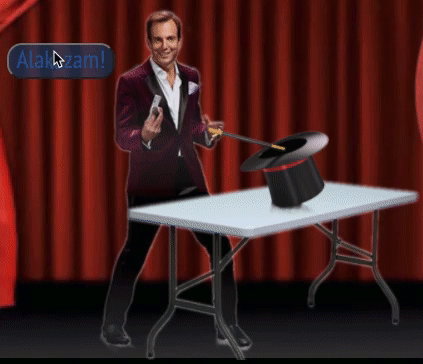

# Melvin's Mediocre Magic Manifestation

## Clear, Concise, Coding Checkpoint Concept Clarification (The six C's?)

After completing this lab we should be more familiar with how the lifecycle with React allows conditional rendering, and gain some familiarity with conditional renders (hopefully with ternary operators!).

## Instructions to install/run go here

## Rough draft of actual readme below here

After getting blacklisted in his previous community, newly re-named Melvin the Magnificent is looking for a new venue for his magic tricks, erm...I mean, *illusions*. Unfortunately, several ongoing lawsuits have restricted his funding (someone burnt down his banana stand) so he is working on limited funds. By the time our show is complete it should look a little something like this:


That being said, all that Melvin has to get us started with is this:


## Pull a rabbit from a hat. Kind of.

Pulling a rabbit out of a hat is a classic trick, but Melvin has no times for tricks, he's a master of ILLUSIONS! Let's see if we can make it SEEM as though the rabbit and hat switch places instead.

To handle this let's take a look at all the needed pieces. 
- There is a `showBunny` state set by default to false. 
- In the `App` component is an `` with an src set to `hat`. 
- There is an image that has already been imported at the top of `App` as `bunny`. 

The goal for our ~~magic trick~~ *illusion* is that when you click `Alakazam` the hat will magically turn into a rabbit, like this:



While there are a lot of ways to handle this logic, the purpose of this lab is to practice ternary conditional toggles, so let's explore how we set up this first one together.

### Toggle function
Since we have a `showBunny` boolean state, we are going to use that state to decide when we are showing the rabbit. The first step we need for that to work is to have a way to change that state at all! Let's create a function called `toggleBunny` that, to start with, simply does a `console.log()` of whatever you'd like.

### Event listener

We know the `Alakazam` button is what we want to trigger the change, so we need to put an event listener on that button to fire `toggleBunny`. If you get stuck the solution is nested below.

<details><summary>Alakazam Button</summary>
<p>

```
<button className="alakazam" onClick={this.toggleBunny}>
    Alakazam!
</button>
```

</p>
</details>

### Toggle state

Once you have successfully connected our `Alakazam` button to our `toggleBunny` function, we need it to actually alter our state. Change the `toggleBunny` function to toggle it's boolean state. When it works you should be able to use your dev tools to see your React component state toggle between `true` and `false`. 

Spend some time seeing if you can figure out how to do that, if you get stuck there is *a* solution below:

<details><summary>toggleBunny() code possibility</summary>
<p>

```
 toggleBunny = () => {
    this.setState({ showBunny: !this.state.showBunny });
  };
```

</p>
</details>

### Conditional render with a ternary

There are *many* ways you could do this next path, and I highly encourage you explore any/all of them. This lab will focus on using `ternary operators` as a tool for conditional rendering.

Our `` src is currently set to hat, but now that we have our state of `showBunny` switching between `true` and `false` we want to have that reflected on our front end. In "plain" English, when our `showBunny` state is set to `true`, we want to see our bunny!

With JSX and React we have a way to directly put our JavaScript logic into our HTML code. There is a comment in the code indicating where and what you need to do. A quick review of the structure of a ternary:

```
condition ? ifTrue : ifFalse
```

`Condition` is what condition is being evaluated, and it expects a return of `true` or `false`. A `?` indicates the end of the conditional, and starts `ifTrue` which is what is run if the `condition` returns true, and if it's inline it is implicitly returned. A `:` indicates the `else`, and is followed by what happens if the `condition` returns false.

Experiment with trying to figure out how to use a ternary to make the src of the `` toggle in response to the `showBunny` state. If you get stuck the solution is below.

<details><summary>Ternary src toggle</summary>
<p>

```
src={this.state.showBunny ? bunny : hat}
```

</p>
</details>

### Success!

You've completed a conditional render in React using a ternary operator, and also done an amazing ~~magic trick~~ illusion!

This is the base template for every other aspect of this lab. Use it to explore (and hopefully have fun with) conditional rendering!

## The knife throwing illusion

Melvin is wanting to step up the intensity of his act. Despite his disregard for safety he decided to do a knife throwing act! 

In state is a `knifeThrown` and `volunteerSelected` state set by default to false. There is an `IllusionControls` component that has several buttons and a `KnifeIllusion` component with images imported at the top. The deliverables for this ~~magic trick~~ illusion are as follows:

- Using the `volunteerSelected` state in `App`, we should be able to click the "Pick Volunteer" button in `IllusionControls` and have our...not so willing volunteer (the `ReadyBuster` import) join us on stage in the `KnifeIllusion` component.

- Using the `knifeThrown` state in `App` we should be able to click the "Throw Knife" button in `IllusionControls` and make our knife magically appear thrown into the board in the `KnifeIllusion` component.

*BONUS*

- Melvin hasn't been practicing his knife throwing a whole lot...we were able to capture an image of his volunteer after his first knife throwing attempt. Can you set up the image of the volunteer shifts from `ReadyBuster` to `UhOhBuster` if the the volunteer is chosen and the knife is thrown, but stay `ReadyBuster` if the knife has not been thrown yet?

- Melvin doesn't want his volunteer to leave without his permission. Can you set it up to where the volunteer button can't be clicked again once the volunteer has been selected? Maybe you can change up the button text too, since a volunteer has already been chosen?

- Melvin also doesn't want to have to go and get his knife after he threw it, he wants you to make his knife button work the same way as above. Once you throw it it's stuck there!

- Now Melvin is seeing the folly of his ways, he could only do the trick once if the buttons don't work! But...he's still lazy. Can you make the "Reset Illusion" button set all his ~~magic trick~~ illusions back to where they were at the start? All the values in state should be set to `false`.